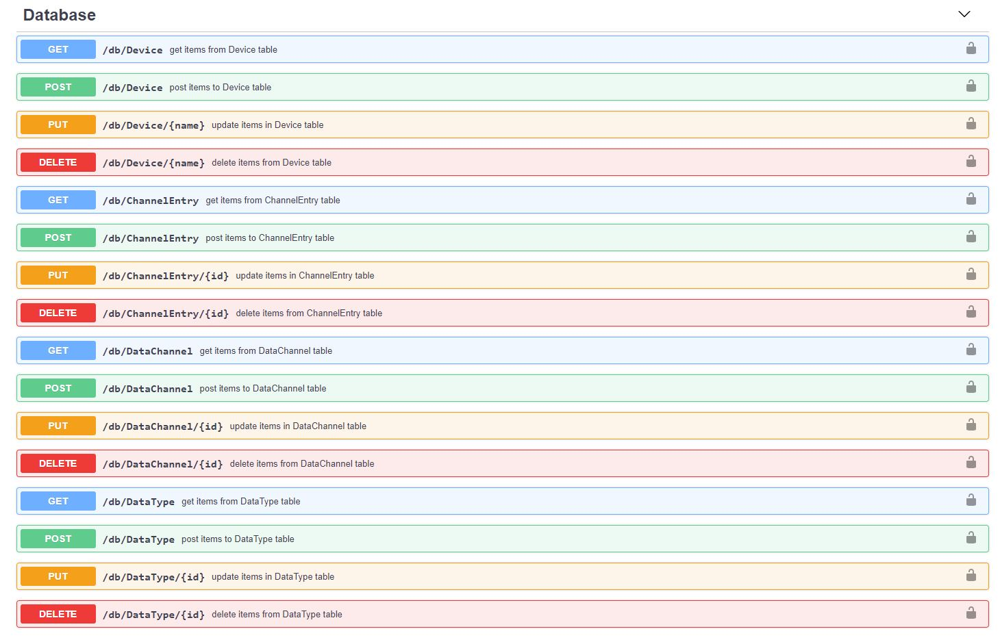

# Fast Pony CRUD
A tool for easily adding database CRUD routes using pony orm and FastAPI. This package works with database definitions using the common pony orm data types, but it still needs to be tested on all of them. 

# Installation
using pip:
```
pip install fast-pony-crud
```
# Usage:
Define your database. You can do this in code, or you can use the [Pony ORM online editor](https://editor.ponyorm.com/). You will end up with a file that looks something like this. save it as "db.py". 
```
from datetime import datetime
from pony.orm import *

db = Database()

class Device(db.Entity):
    name = PrimaryKey(str)
    data_channels = Set('DataChannel')

class ChannelEntry(db.Entity):
    id = PrimaryKey(int, auto=True)
    time = Required(datetime,default=lambda:datetime.utcnow())
    numeric_value = Optional(float)
    metadata = Optional(Json)
    data_channel = Required('DataChannel')

class DataChannel(db.Entity):
    id = PrimaryKey(int, auto=True)
    name = Required(str)
    device = Required(Device)
    device_time_entrys = Set(ChannelEntry)
    data_type = Required('DataType')

class DataType(db.Entity):
    id = PrimaryKey(str)
    data_channels = Set(DataChannel)
    metadata_config = Optional(Json)
```
Set up your API. Here we follow steps similar to the ones outlined in the [FastAPI guide](https://fastapi.tiangolo.com/tutorial/first-steps/). The example uses an sqlite database for simplicity, but pony can [connect to a variety of database backends](https://docs.ponyorm.org/database.html). Save this file as "api.py".
```
from fastapi import FastAPI
from db import db # imports our database definition
from fast_pony_crud import create_crud_routes
import uvicorn

app = FastAPI()

# Connect to database
db.bind(provider='sqlite', filename='database.sqlite', create_db=True)
db.generate_mapping(create_tables=True)

# this is where the magic happens:
create_crud_routes(
    db,
    app,
    prefix="/db", # prefix for all datbase crud routes
    api_key="YOUR_SECRET_KEY") # api key for authentification sent on request headers
```

Launch the app by typing the following in your command shell:
```
uvicorn api:app --reload
```
Now you can view your api docs by going to http://127.0.0.1:8000/docs


